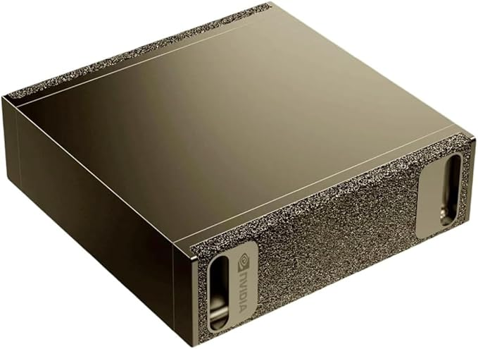
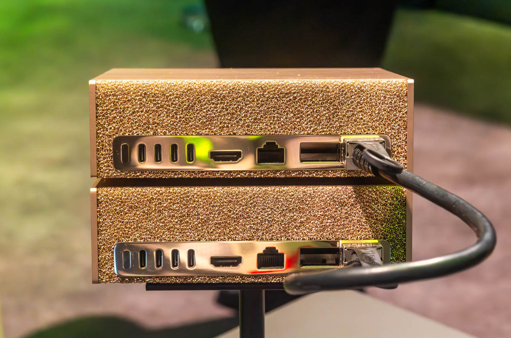

**Business Justification: NVIDIA DGX Spark Local AI Development Workstation**  
**Prepared by:** [Your Name], Senior Sales Engineer  
**Date:** June 2026  
**For:** [Manager Name / IT / Procurement]

## Executive Summary

As a Senior Sales Engineer at Cloudera, I am currently limited by company-issued MacBook hardware and a personal GPU with insufficient VRAM and performance for modern AI workloads. I rely heavily on company-provided Claude for code assistance, agent development, and prototyping.

This request is for a **NVIDIA DGX Spark** (desktop AI supercomputer) as a one-time business expense (~$4,699). The primary purpose is to enable **local AI development and local demos** that integrate with Cloudera products — specifically **CDP Base** and **CDP Operators**.

**Local AI is the future.** Having dedicated local GPU capacity will allow me to rapidly prototype, test, and demonstrate next-generation AI capabilities directly alongside Cloudera’s data platform — something that is increasingly expected by customers. This investment will improve demo quality, reduce dependency on cloud APIs for development work, enhance data privacy during customer engagements, and better position Cloudera in a market moving toward local and hybrid AI architectures.

**Estimated one-time cost**: ~$4,700 (highly cost-effective compared to ongoing cloud API spend and lost productivity).

### Current Challenges

- **Hardware limitations**: Current MacBook + personal GPU lacks the VRAM and sustained performance needed to run large models locally for development and demo purposes.
- **High cloud dependency for development**: Heavy use of Claude for coding and prototyping drives significant token consumption and cost.
- **Demo and productivity bottlenecks**: Building compelling local demos that combine **Cloudera CDP Base / CDP Operators** with modern AI capabilities requires fast, private, and repeatable local execution. Cloud-based tools introduce latency, cost, and data transfer concerns during customer-facing work.
- **Competitive disadvantage**: Slower iteration cycles and weaker ability to showcase **local AI + Cloudera** integrations put us at a disadvantage as customers increasingly ask about on-premises and local AI options.

### Proposed Solution: NVIDIA DGX Spark for Local AI

The **NVIDIA DGX Spark** is a compact, high-performance desktop AI system purpose-built for local development and demonstration workloads. It comes preloaded with the full NVIDIA AI software stack (including NIM microservices) and delivers data-center-class performance in a form factor suitable for an individual engineer.

**Key Specifications** (as of June 2026):

- **Architecture**: NVIDIA Grace Blackwell (GB10 Superchip)
- **Performance**: Up to **1 PFLOP** FP4 AI performance
- **Memory**: **128 GB** coherent unified memory (CPU + GPU)
- **Model Capabilities**: Local inference on models up to 200 billion parameters; fine-tuning up to 70 billion parameters
- **Storage**: 4 TB NVMe SSD (self-encrypting)
- **Networking**: NVIDIA ConnectX-7 (200 Gb/s)
- **Power & Form Factor**: ~240W, compact desktop design

{width=600px}
{width=600px}

This system will be used exclusively for **local AI development and local demos**. It will allow me to:

- Rapidly prototype and test AI agents and workflows locally
- Build and run **local demos** that integrate AI capabilities with **Cloudera CDP Base** and **CDP Operators**
- Develop and validate integrations that can later be deployed to full Cloudera AI environments (on-premises clusters or public cloud)

**Important clarification**: This device is **not** intended to replace our existing access to Claude or production Cloudera AI platforms. It is a complementary tool that accelerates local development and enables high-quality, private, offline-capable customer demos.

**Pricing**: Approximately **$4,699**

### Business Benefits & ROI

- **Faster Local Development & Iteration**: Local execution removes cloud latency and queue times, enabling much faster prototyping of AI features that integrate with Cloudera CDP.
- **Superior Local Demos**: Deliver compelling, real-time demonstrations of **Cloudera + Local AI** directly to customers without relying on cloud connectivity or exposing sensitive data.
- **Cost Control**: Reduce token consumption on Claude for development and prototyping work by shifting suitable workloads to local models.
- **Data Privacy & Security**: Keep customer data and proprietary demo content local during development and customer engagements.
- **Strategic Positioning**: Positions Cloudera Sales Engineers to demonstrate that we understand and can deliver on the growing demand for **Local AI** alongside our enterprise data platform.
- **ROI**: One-time hardware investment with rapid payback through improved demo effectiveness, faster sales cycles, and reduced cloud API spend on development work.

### Alignment with Cloudera + NVIDIA Strategy

Cloudera has a strong partnership with NVIDIA focused on accelerating enterprise AI through technologies such as NVIDIA NIM microservices and RAPIDS. 

A local DGX Spark gives Sales Engineers the ability to **prototype and demonstrate** these integrations locally first. This includes building demos that combine local AI models with **CDP Base** and **CDP Operators**, then showing how similar patterns can scale into full Cloudera AI deployments (whether on-premises GPU clusters or public cloud environments).

The local GPU serves as an excellent development and demonstration environment. Production workloads will continue to run on appropriately sized Cloudera AI infrastructure as they do today.

### Alternatives Considered

| Option | Pros | Cons | Approx. Cost | Recommendation |
|--------|------|------|--------------|----------------|
| Continue current setup | No new spend | Insufficient performance for local AI work; high cloud costs; weak demo capability | Ongoing high | Not viable |
| Cloud GPU instances only | Scalable | Latency, cost, and privacy issues for local demos | High ongoing | Good supplement, not replacement |
| Consumer GPU workstation (e.g. RTX 5090) | Lower cost | Limited memory and enterprise optimizations | $2k–$6k+ | Possible short-term option |
| DGX Station (higher-end) | Significantly more power | Much higher cost; overkill for individual use | $50k–$100k+ range | Consider later for shared/team use |
| Full OEM AI servers | Enterprise features | Overkill and complex for local development/demo use | Varies widely | Better suited for production clusters |

**Recommended approach**: Approve the **NVIDIA DGX Spark** as the most practical and cost-effective solution for enabling **local AI** development and demos for Sales Engineers.

### Supporting External Resources & Evidence

- **NVIDIA DGX Spark Official Product Page**  
  https://www.nvidia.com/en-us/products/workstations/dgx-spark/

- **NVIDIA Marketplace – DGX Spark** (pricing)  
  https://marketplace.nvidia.com/en-us/enterprise/personal-ai-supercomputers/dgx-spark/

- **NVIDIA Blog: DGX Spark and DGX Station Power the Latest Open-Source and Frontier Models From the Desktop**  
  https://blogs.nvidia.com/blog/dgx-spark-and-station-open-source-frontier-models/

- **Red Hat: Supercharging local AI development with RHEL on NVIDIA DGX Spark**  
  https://www.redhat.com/en/blog/supercharging-local-ai-development-rhel-nvidia-dgx-spark

- **Cloudera NVIDIA Partner Page**  
  https://www.cloudera.com/partners/solutions/nvidia.html

- **Cloudera Press Release: Expanded collaboration with NVIDIA for Generative AI**  
  https://www.cloudera.com/about/news-and-blogs/press-releases/2024-03-19-cloudera-and-nvidia-collaborate-to-expand-generative-ai-capabilities-with-nvidia-microservices.html

- **YouTube – NVIDIA DGX Spark: Rapid AI Agent Development**  
  https://www.youtube.com/watch?v=yD72eaCOQjA

### Recommendation & Next Steps

I recommend approving the purchase of one **NVIDIA DGX Spark** (~$4,699) as a business expense. This will equip me to deliver higher-quality local AI demos integrated with Cloudera CDP and better support the growing customer interest in **Local AI** capabilities.

**Suggested next steps**:
1. Review and approve this request.
2. Coordinate purchase through IT/Procurement via NVIDIA Marketplace or an authorized partner.
3. Pilot for 30–60 days and track impact on demo quality, development speed, cloud API usage, and Overall Content Output.
4. Evaluate expanding access to additional Sales Engineers if the pilot is successful.

Thank you for considering this investment in enabling **Local AI** as a core capability for our Sales Engineering team.
